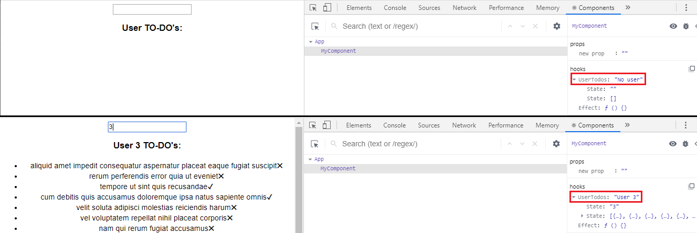

# 16 Use Debug Value

El hook interno _useDebugValue_ es útil para depurar custom hooks usando las React DevTools. Este hook te permite mostrar una etiqueta para un custom hook.

# Pasos

- Tomaremos como punto de partida el ejemplo _00 boilerplate_. Copia el contenido del proyecto a una carpeta nueva y ejecuta _npm install_.

```bash
npm install
```

- Abramos el fichero _demo.js_. Añadamos el contenido que aparece justo aquí abajo (un custom hook que guarda un usuario y almacena sus TO-DO's).

_./src/demo.js_

```jsx
import React from "react";

const useUserTodos = () => {
  const [user, setUser] = React.useState("");
  const [userTodos, setUserTodos] = React.useState([]);

  const loadTodos = () => {
    fetch(`https://jsonplaceholder.typicode.com/todos?userId=${user}`)
      .then(response => response.json())
      .then(json => {
        console.log(userTodos);
        setUserTodos(json);
      });
  };

  return { user, setUser, userTodos, loadTodos };
};

export const MyComponent = () => {
  const { user, setUser, userTodos, loadTodos } = useUserTodos();

  React.useEffect(() => {
    loadTodos();
  }, [user]);

  return (
    <div>
      <input value={user} onChange={e => setUser(e.target.value)} />
      <h3>User {user} TO-DO's:</h3>
      <ul>
        {userTodos.map((todo, index) => (
          <li key={index}>
            {todo.title}
            {todo.completed ? <>&#10004;</> : <>&#10006;</>}
          </li>
        ))}
      </ul>
    </div>
  );
};
```

- Ahora tenemos que añadir el hook _useDebugValue_. En este caso mostraremos una etiqueta indicando el contenido de _user_.

_./src/demo.js_
```diff
import React from "react";

const useUserTodos = () => {
  const [user, setUser] = React.useState("");
  const [userTodos, setUserTodos] = React.useState([]);

  const loadTodos = () => {
    fetch(`https://jsonplaceholder.typicode.com/todos?userId=${user}`)
      .then(response => response.json())
      .then(json => {
        console.log(userTodos);
        setUserTodos(json);
      });
  };

+ React.useDebugValue(user !== "" ? `User ${user}` : 'No user');

  return { user, setUser, userTodos, loadTodos };
};

export const MyComponent = () => {
  const { user, setUser, userTodos, loadTodos } = useUserTodos();

  React.useEffect(() => {
    loadTodos();
  }, [user]);

  return (
    <div>
      <input value={user} onChange={e => setUser(e.target.value)} />
      <h3>User {user} TO-DO's:</h3>
      <ul>
        {userTodos.map((todo, index) => (
          <li key={index}>
            {todo.title}
            {todo.completed ? <>&#10004;</> : <>&#10006;</>}
          </li>
        ))}
      </ul>
    </div>
  );
};
```

- Ejecuta el ejemplo
```bash
npm start
```

- Abre las React DevTools en Chrome o Firefox. En la sección _hooks_ puedes ver el valor de depuración de el custom hook.



# ¿Te apuntas a nuestro máster?

Si te ha gustado este ejemplo y tienes ganas de aprender Front End
guiado por un grupo de profesionales ¿Por qué no te apuntas a
nuestro [Máster Front End Online Lemoncode](https://lemoncode.net/master-frontend#inicio-banner)? Tenemos tanto edición de convocatoria
con clases en vivo, como edición continua con mentorización, para
que puedas ir a tu ritmo y aprender mucho.

Y si tienes ganas de meterte una zambullida en el mundo _devops_
apuntate nuestro [Bootcamp devops online Lemoncode](https://lemoncode.net/bootcamp-devops#bootcamp-devops/inicio)